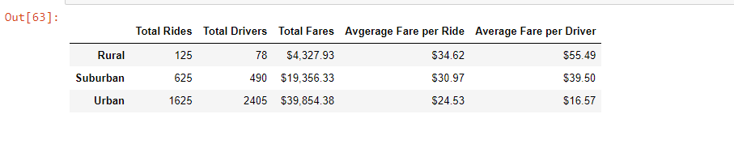
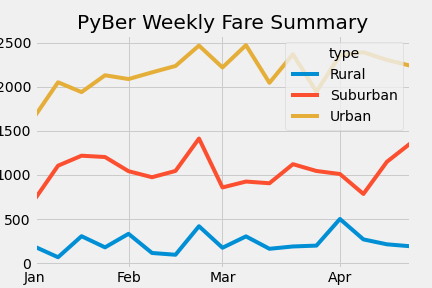

# PyBer Analysis
## Overview of the analysis
The purpose of this analysis is to show a summary of PyBer ride-sharing data per city type and compare the total weekly fares for each city type for the selected time period of 01/01/2019 to 29/04/2019.

## Results
### Summary of ride-sharing data

The summary shows that urban cities are the most profitable ones. 
### Total weekly fares for each city type

The chart shows that urban cities has the highest weekly average. Also urban cities has peak earnings in third week of March and first week of April with 2,500$ each.

## Summary
In light of the above results, PyBer is recommended to act as per the following:
1. Increase number of number of drivers in rural areas as the the average fare per driver is the highest among all city types.
2. Inquire about the reasons behind the drop in total weekly fares in the third week of March for urban and rural cities.
3. Conduct a targeted marketing campaign to increase the ridership in rural cities.
